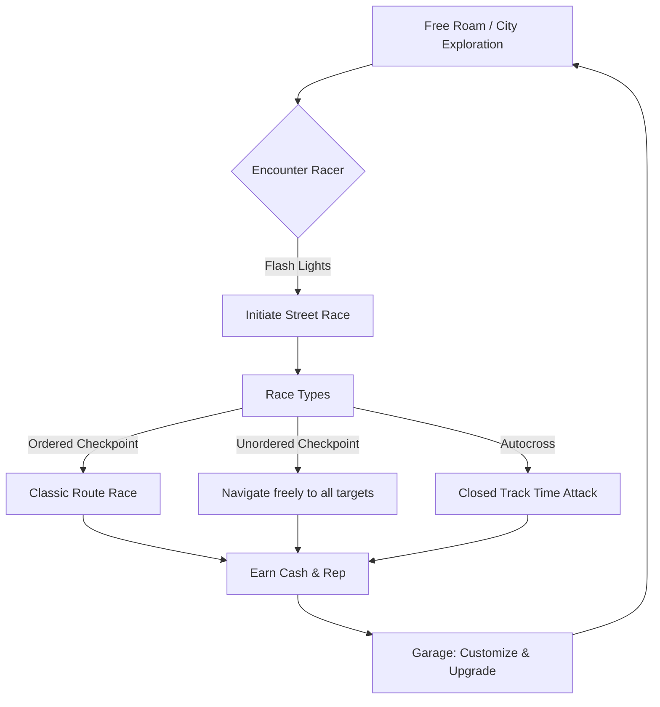

# Midnight Club: Voxel Edition - Game Design Document

> [!NOTE]
> This document details the complete design for **Midnight Club: Voxel Edition**, a spiritual successor to the classic street-racing franchise reimagined in a stylized, high-performance voxel aesthetic.

---

## 1. Executive Summary & Vision

### 1.1. Concept
**Midnight Club: Voxel Edition** is an open-world arcade street racing game. By utilizing a **voxel-based art style**, the game captures a vibrant, retro-futuristic aesthetic with glowing neon lights, rain-slicked asphalt, and fully destructible props without the need for expensive high-fidelity 3D assets.

### 1.2. Key Pillars
*   **Speed & Flow:** Fast-paced arcade handling, satisfying drift mechanics, nitro boosts, and slipstream drafting.
*   **Open-World Exploration:** A dense, vertical city packed with shortcuts, jumps, hidden alleyways, and secrets.
*   **Stylized Destruction:** Car panels shatter into voxel debris on impact; lamp posts, fences, and outdoor seating explode realistically when hit.
*   **Vibrant Voxel Nightlife:** Curated HSL neon color palettes, glowing emissive lights, and screen-space reflections that make the night city feel alive.
*   **Deep Arcade Customization:** Build, modify, and tune voxel vehicles in a modular garage.

### 1.3. Midnight Club DNA
*   **Open City Checkpoints:** Checkpoints are indicated by tall glowing pillars of colored smoke. Players can take any route, shortcut, or alleyway to get to them.
*   **Insane Sense of Speed:** High velocity, screen shake, wind lines, and tail-light trails.
*   **Arcade Physics with Depth:** Satisfying drift mechanics, weight transfer, and nitrous oxide speed bursts.

---

## 2. Core Gameplay & Mechanics



### 2.1. Race Types
1.  **Ordered Checkpoint:** Drive through a series of checkpoints in a specific order. The route is open, meaning players must find the best shortcuts between checkpoints.
2.  **Unordered Checkpoint:** Several checkpoints appear across a sector of the city. The player can collect them in any order; routing strategy is key.
3.  **Circuit Race:** Traditional lap-based racing on closed-off city streets.
4.  **Autocross:** Time-attack races through coned tracks with zero traffic, focusing on precision cornering.

### 2.2. The Police Heat System
*   **Infractions:** Speeding, colliding with traffic, or initiating street races near police patrols triggers a pursuit.
*   **Heat Levels (1–5):**
    *   *Level 1:* Basic cruisers, easily outrun.
    *   *Level 2:* Aggressive cruisers, roadblocks.
    *   *Level 3:* Voxel muscle interceptors, spike strips.
    *   *Level 4:* Heavy voxel SUVs trying to ram the player off-course.
    *   *Level 5:* Helicopter spotlight tracking, aggressive PIT maneuvers.
*   **Escape Mechanics:** Break line-of-sight and hide in dark alleys, underground garages, or parkades until the heat decays.

### 2.3. Special Abilities (Class-Based)
*   **Zone:** Slows down time for precision maneuvering through tight gaps or heavy traffic.
*   **Agro:** Increases vehicle weight and durability, allowing players to plow through traffic and opponents.
*   **Roar:** Unleashes a shockwave that pushes surrounding traffic out of the way.

---

## 3. 3D Car Physics Model

To capture the feel of "actual car physics" within an arcade setting, the vehicle physics simulator must implement:

### 3.1. Suspension and Grounding
*   **Four-Point Raycasting:** The car uses 4 raycasts (one for each wheel) pointing downwards from the chassis to detect the road distance, normal, and ground material.
*   **Spring & Damper (Hooke's Law):** 
    $$F_{suspension} = K_{spring} \times (Length_{rest} - Length_{current}) - D_{damper} \times Velocity_{vertical}$$
    This creates realistic suspension bounces, weight distribution on braking/acceleration, and body roll when cornering.

### 3.2. Traction, Steering, and Drifting
*   **Longitudinal Force (Acceleration/Braking):** Torque applied to wheels based on engine power curves, translating into forward acceleration.
*   **Lateral Force (Steering & Slip):** Sideways friction that resists sliding.
*   **Drifting Mechanic:** When handbrake (Spacebar) is pressed or a sharp turn is made, the lateral friction coefficient drops. The car slides sideways. Steering into the drift balances the angle, and releasing the drift triggers a speed boost representing traction snap-back.
*   **Slipstream (Drafting):** Follow closely behind an opponent to fill a slipstream meter. Once full, trigger a temporary velocity boost.
*   **Nitro System:** Refills via near-misses, drifting, and catching air time.

### 3.3. Collision Responses & Voxel Damage
*   **Voxel Destruction:** Solid objects (fences, light posts, mailboxes) are composed of voxel clusters. Colliding with them detaches voxel pieces, scattering them into the scene with dynamic physics.
*   **Car Damage:** Vehicles are composed of modular voxel matrices (front bumper, hood, side skirts, roof, spoiler). Upon impact, voxels at the point of collision detach, fly off, and bounce on the street with gravity and physics. Deformation is simulated by removing layers of voxels, exposing inner chassis details.

---

## 4. Checkpoint System & The "Smoke Column" Effect

A core visual signature of the *Midnight Club* franchise is the tall, towering checkpoint beacons.

```
       [Skyline / Height Limit]
                  ||
                  ||  <-- Towering, swirling particle smoke
                  ||      (Matches checkpoint color: Yellow/Red)
                  ||
             .----||----.
            /     ||     \
           /      ||      \
     =====(   Checkpoint   )=====
           \      ||      /
            \     ||     /
             '----||----'
             [Road Surface]
```

### 4.1. Smoke Column Visuals
*   **Aura Glow:** A bright, semi-transparent cylinder at the base indicating the trigger radius.
*   **Particle Emitter:** A high-density particle emitter spawning textured smoke sprites that rise vertically.
*   **Turbulence & Dissipation:** The smoke particles swirl (using a noise function) and expand as they rise, slowly fading out near the city's skyline height.
*   **Dynamic Colors:**
    *   **Yellow/Orange:** Standard checkpoints along the race route.
    *   **Red:** The final finish line checkpoint.
    *   **Green:** Optional checkpoints or race start locations.

### 4.2. Checkpoint Logic
*   **Radius Trigger:** Simple 3D distance check between the car position and the checkpoint center ($Distance_{2D} < Radius$).
*   **Order Tracking:** Players must pass through checkpoint $N$ before checkpoint $N+1$ becomes active and visible.
*   **Smoke Fade-out:** Once triggered, the current checkpoint's smoke column bursts outward into a circular ring of sparkles and fades, while the next checkpoint column ignites in the distance.

---

## 5. Procedural City Map Generation

To create an infinite or large-scale racing environment without manually modeling a city, the game uses **procedural voxel city generation**:

### 5.1. Road Network Generation
*   **Grid Graph System:** The city layout is defined by a grid array where cells represent either **Road Segments** or **Building Blocks**.
*   **Intersections & Highway Rings:** An outer loop acts as a highway ring (for high-speed muscle cars), while the inner grid creates tight 90-degree street intersections suited for tuner drift-runs.
*   **Shortcuts and Alleys:** Randomly generated path openings (e.g., breaking through fences or office lobbies) create alternative routes.

### 5.2. Procedural Voxel Building Spawning
```
  [Procedural Building Blueprint]
      +-------------------+
      |   Rooftop Heli    |  <-- Height determined by noise function
      +-------------------+
      |   Floor N (Neon)  |  <-- Randomly placed glowing ads/windows
      +-------------------+
      |   Floor 1 (Lobby) |  <-- Glass-walled, destructible lobby
      +-------------------+
```
*   **Dynamic Skyscrapers:** Each building is constructed of pre-defined voxel floor segments stacked vertically. The height is determined by a Perlin noise map (taller in the "downtown" center, shorter at the edges).
*   **Emissive Window Matrices:** Window textures are voxel meshes with randomized emissive values to simulate lights turning on/off in offices.

### 5.3. Procedural Checkpoint Route Generation
*   **Graph Traversal (Race Builder):** To build a race route, the generator chooses a starting node on the road network and runs a random walk algorithm with minimum/maximum segment distances.
*   **Collision-Free Checkpoints:** Checkpoints are spawned directly in the center of intersections or on road segments, ensuring they are always reachable.

---

## 6. Art Style, Customization & Progression

### 6.1. Voxel Palette & Lighting
*   **Nighttime Focus:** The game is set entirely between dusk and dawn.
*   **Color Design:** High-contrast neon hues (Cyan, Magenta, Acid Green, and Electric Purple) set against dark, wet asphalt and dark obsidian-colored skyscraper blocks.
*   **Emissive Materials:** Headlights, taillights, streetlights, billboard advertisements, and underglow neon use high-intensity emissive materials to cast dynamic light onto the environment.
*   **Weather Effects:** Wet road surfaces with metallic/glossy materials to reflect the voxel buildings and neon signs.

### 6.2. The Voxel Garage
Players can customize vehicles using a modular, grid-based interface:
*   **Body Styling:** Swap voxel bumpers, hoods, fenders, spoilers, and rims.
*   **Voxel Paint Shop:** Paint individual voxels, apply pixel art decals, and choose between matte, metallic, chrome, or glowing paints.
*   **Performance Upgrades:** Upgrade Engine, Turbo, Suspension, Brakes, and Tires using cash earned from races.

### 6.3. Vehicle Archetypes
*   **Tuners:** Exceptional handling and drift control. Perfect for tight street circuits.
*   **Muscles:** High straight-line acceleration and top speed, but heavy handling. Great for highway runs.
*   **Exotics:** High-end performance, balanced stats, expensive upgrades.
*   **Bikes (Motorcycles):** Extremely fast and nimble, capable of pulling wheelies and fitting through narrow gaps, but high risk of crashing upon impact.

---

## 7. Controls Mapping

| Action | Keyboard Input | Gamepad Input |
| :--- | :--- | :--- |
| **Accelerate** | `W` / Up Arrow | R2 / Right Trigger |
| **Brake / Reverse** | `S` / Down Arrow | L2 / Left Trigger |
| **Steer Left/Right**| `A`/`D` / Left/Right Arrow | Left Analog Stick |
| **Handbrake (Drift)**| `Spacebar` | Cross (Playstation) / A (Xbox) |
| **Nitrous Boost** | `Shift` | Circle (Playstation) / B (Xbox) |
| **Reset Car** | `R` | Select / Back |

